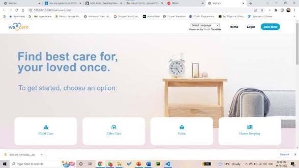

# Miniproject-Care_Provider

**Chapter 1** 

**Introduction**

Nowadays, every technical field is trying to style human life at ease. With the rapid growth in the use of the internet and the technologies associated with it, several opportunities are coming up in the web or mobile application. In today’s busy life we are in a great rush to make money. But in the end, we are unable to spare time for our loved ones. As we are unknowingly ignoring this issue and care for our loved ones is important. So, we have come over with the idea to provide care for everyone in need. The application “We Care” is developed to bridge the gap between caregivers and the people who need care. In a more efficient and manageable way. By using this application we can reduce the manual search for professional and trustworthy caregivers, who will look out for your loved ones in your absence. 

We Care website is designed to bridge the gap between caregivers, caretakers, and customers.  This  website  provides  caregivers  for  any  time  period.  This  System  divides household care into five main categories. These categories are Child Care, Elder Care, Tutor, Housekeeping, Day Care, and Pet Care. We Care aims to help everyone who needs a perfect caretaker for their loved ones. 

We Care will become an important application for any individual to find the care instantly at the moment of need. Users need not waste their time in finding the care at  the moment of need. Our caregiving website will provide various options to the user. These options will be based on the filters provided by users. The caregivers are provided according to categories. These caregivers will help the user to take care of their loved ones in their absence.  

1. **Purpose :** 

Technology is constantly changing the way we live our lives, from living in the metaverse to getting a prescription on a smartphone app, our lives are transforming fast. The innovation in WEB apps or as we like to call it “Appnovation” is taking over every industry and healthcare is not behind. With the booming app market with its ability to keep you in close touch with your audience, healthcare as we knew  it has  changed.  Medical  applications  are becoming increasingly  popular around  the  world,  with  more  people  using  them  for  everything  from  medical treatments to general health and well-being. Every indicator points toward the Healthcare application development boom which brings us to an all-important question. 

1. Bridging the gap between who needs care and who serves care. 
1. Aiming to provide quality services at affordable prices. 
1. Instant booking with desired services 
1. To provide employment for house workers. 
1. To bring this service all over India  
1. We make sure health and social care services provide people with safe,     effective, compassionate, high-quality care and we encourage care services to improve. 
2. **Problem Statement:** 
1. We all are busy in our day to day lives and sometimes it is difficult to manage both work and home simultaneously. 
1. Now-a-days it’s difficult to find a trust worthy person for our loved ones. 

**Solution:** 

1. Here we are introducing WeCare, our app for sharing your responsibilities hand in hand. 
1. We have trained, kind, humble and qualified companions who will help you by staying beside you. 
3. **Objectives:** 
1. To serve people by sharing their responsibilities. 
1. To ensure adequate qualitative care to people.   
1. To provide quality service at an affordable price. 
1. To provide employment in the care sector. 
4. **Scope:** 
1. Bridging gap between who need care and who serves care. 
1. Aiming to provide quality services at affordable prices. 
1. Instant booking with desired services. 
1. To provide employment for house workers. 
1. To bring this service all over India.  

4 
**Chapter2** 

**Literature Review:** 

**[1]THE CHANGE FOUNDATION (Profile of Family caregivers - report):** 

Family caregivers are people, family, and neighbors who provide critical and often ongoing personal, social, and physical support, assistance, and care, without pay, for family members and friends in need of support due to frailty, illness, or physical/cognitive disability circumstances. 

Family caregivers are a vital part of society. They are important to their loved one(s), to the healthcare system, and to the economy. They give up personal time and resources to care for someone else who is in need. 

**[2]Mobile phone apps for family caregivers:** 

The growth of mHealth apps has been exponential in recent years, but there is limited knowledge regarding the availability, functionality, and quality of apps to support family caregivers. Our objectives were to identify the apps currently available to support family caregivers and to analyze the app functions and evaluation claims. 

Family caregivers face challenges balancing care for their loved one(s) with their existing personal and work duties, which may cause negative health effects both physically and psychologically. Mobile health applications (mHealth apps) may be one solution to help family caregivers care for their loved one(s) and themselves. mHealth, as defined by the World Health Organization (WHO) is: “medical and public health practice supported by mobile  devices,  such  as  mobile  phones,  patient  monitoring  devices,  personal  digital assistants, and other wireless devices.” In recent years, there has been a steady increase in the  number  of  mHealth  apps.  In  particular,  the  coronavirus  disease  (COVID-19)  has accelerated the development and adoption of technology in healthcare worldwide. 

5 

**[3]An IoT-based health care system for elderly people:** 

The Internet of Things is a new reality that is completely changing our everyday life, and  promises  to  revolutionize  modern  healthcare  by  enabling  a  more  personalized, preventive and collaborative form of care. Aiming to combine these two important topics, this work presents an IoT-ready solution for the elderly living assistance which is able to monitor and register patients vital information as well as to provide mechanisms to trigger alarms in emergency situations.

6 
**Chapter 9** 

**Proposed System** 

1. User Friendly: 
- Simple and interactive user interface. 
- All services provided at one place. 
2. Categories: 
   1. Select Services according to your requirements. 
2. Personalization: 
   1. We provide customizable services. 
2. Location Base search: 
- Customer can find the nearest available service person in their locality to avail the service nearest to them. 

**Requirement Analysis:** 

There are three main stages in conducting a thorough requirements analysis: 

1. The  first  step  is  to  gather  the  requirements  by  collecting  business  process documentation and conducting interviews with stakeholders.
1. Next,  analyze  and  validate  the  requirements,  evaluating  whether  they're  clear, complete, consistent, and unambiguous.
1. Finally, record the requirements and monitor their implementation throughout the project.
1. **Data flow program**: A data flow program (DFP) defines the project scope without delving into elaborate details.
1. **Use cases**: Use cases can help define system behavior and communicate from the end user's perspective.

**FUNCTIONAL REQUIREMENTS** 

1. They are the key functions without which, the app would not function, or do what it is supposed to do.** 
1. These are requirements that must be met, and cannot be done without**.** 

**Project Design** 

1. **Use Case Diagram:**

Fig 5.1: Use Case Diagram 

9 

2. **Dataflow Diagram:** 

Fig5.2: DFD Level 1 Diagram 

10 

Fig 5.3: DFD Level 2 Diagram 

Fig 5.4: DFD Level 2 Digram 

12 
**Chapter 14** 

**Technical Specifications:** 

**Development: VS Code** 

VS Code also known as Visual Studio Code is a source code editor made by Microsoft for Windows, Linux, MacOS. It has various features such as Debugging, Syntax highlighting, extension, intelligent code completion. 

**Frontend: Html, CSS, JavaScript** 

As a web developer, the three main languages we use to build websites are HTML, CSS, and JavaScript. JavaScript is the programming language, we use HTML to structure the site, and we use CSS to design and layout the web page. These days, CSS has become more than just a design language, though. You can actually implement animations and smooth transitions with just CSS. 

**Backend: Firebase** 

Firebase is a Backend as a service app development platform that provides hosted backend services such as a real-time database, cloud storage, authentication, crash reporting, machine learning, remote configuration, and hosting for your static files.

**Project Scheduling Template**  

|**Sr. No** |**Group Member** |**Time duration** |**Work to be done** |
| - | - | - | - |
|**1** |Purvesh Gangapurkar|1st week of August |Implementing 1st module/ functionality (*mention the name of module/ functionality at the place of 1st module/functionality*)|
|||2nd week of August** |
Testing 1st module 

(*mention the name of module/ functionality at the place of 1st module/functionality*) 
|
|**2** |Rahul Patil|
rd

3 week of August 
|Implementing 2nd module/ functionality (*mention the name of module/ functionality at the place of 1st module/functionality*) |
|**3** |Ambadas Malegave|By the end of September month |Implementing 3rd module/ functionality (*mention the name of module/ functionality at the place of 1st module/functionality*)|

14 
**Chapter8** 

**Implementation:** 

Fig.8.1 Dashboard

` `Fig: 8.2 Dashboard 

15 
**Chapter  16** 

**Result And Discussion:** 

**Dashboard:** 

Fig 9.1 Dashboard

All the important information and functions are displayed on this page. User can select required services from different categories. 

16 

**Login: **

Fig 9.2 Login 

Users can log in through log in page and new user can register themselves using registration page. **Registration: **

Fig 9.3 Registration 

17 

**Apply for Job: **

Fig. 9.4 Apply for job 

**Booking Page:** 

Fig. 9.5 Booking Page 

**E-R Digram: **

Fig. 9.6 E-R Diagram 

**Chapter 10** 

**Conclusion and Future Scope:**

Thus, care providing website will provide a user-friendly and easy interface to operate. Users can find caregivers of their choice. Users can select from various types of categories such as child care, elder care, etc. Users are able to translate the content of the website according to their preferences. Hence WeCare is a very helpful website for those who need care for their loved ones**.**    

**In the end, it is concluded that we have made effort on the following points…** 

- Made a statement of the aims and objectives of the project. 
- The description of Purpose, Scope, and applicability. 
- We define the problem on which we are working on the project. 
- We describe the requirement Specifications of the system. 
- We understand the problem domain and produce a model of the system, which describes operations that can be performed on the system. 
  - We designed the user interface and security issues related to the system. 
- Finally, the system is implemented and tested 

**Future Scope:** 

1. We aim to make website more user friendly and attractive. 
1. To reach to the greater number of users and caregivers. 
1. To provide user specific customization based on there preferences. 
1. We aim to provide more customization option according to user’s need.  

**References:** 

1. The  Change  Foundation.  Profile  of  family  caregivers report.[ https://changefoundation.ca/wp-content/uploads/2016/06/Profile-of- Family-Caregivers-report-FINAL.pdf ](https://changefoundation.ca/wp-content/uploads/2016/06/Profile-of-Family-Caregivers-report-FINAL.pdf)(2016, accessed 17 Nov 2021). 
1. Ploeg  J,  Markle-Reid  M,  Valaitis  R,  et  al. Web-based  interventions  to improve mental health, general caregiving outcomes, and general health for informal caregivers of adults with chronic conditions living in the community: rapid  evidence  review. *J  Med  Internet  Res* 2017; 19:  e263. [\[PMC  free article\]](https://www.ncbi.nlm.nih.gov/pmc/articles/PMC5554353/) [\[PubMed\]](https://pubmed.ncbi.nlm.nih.gov/28754652) [\[Google Scholar\]](https://scholar.google.com/scholar_lookup?journal=J+Med+Internet+Res&title=Web-based+interventions+to+improve+mental+health,+general+caregiving+outcomes,+and+general+health+for+informal+caregivers+of+adults+with+chronic+conditions+living+in+the+community:+rapid+evidence+review&author=J+Ploeg&author=M+Markle-Reid&author=R+Valaitis&volume=19&publication_year=2017&pages=e263&pmid=28754652&) 
1. Fox  S,  Brenner  J.  Family  caregivers  online.[ https://conalma.org/wp- content/uploads/2012/09/Family-Caregivers-Online.pdf.](https://conalma.org/wp-content/uploads/2012/09/Family-Caregivers-Online.pdf)  (2012,  accessed  17 Nov 2021). 

[4]We-care:  An  IoT-based  health  care  system  for  elderly  people. [https://ieeexplore.ieee.org/abstract/document/7915565 ](https://ieeexplore.ieee.org/abstract/document/7915565) (**Published  in** 2017 IEEE International Conference on Industrial Technology (ICIT)).
21 
